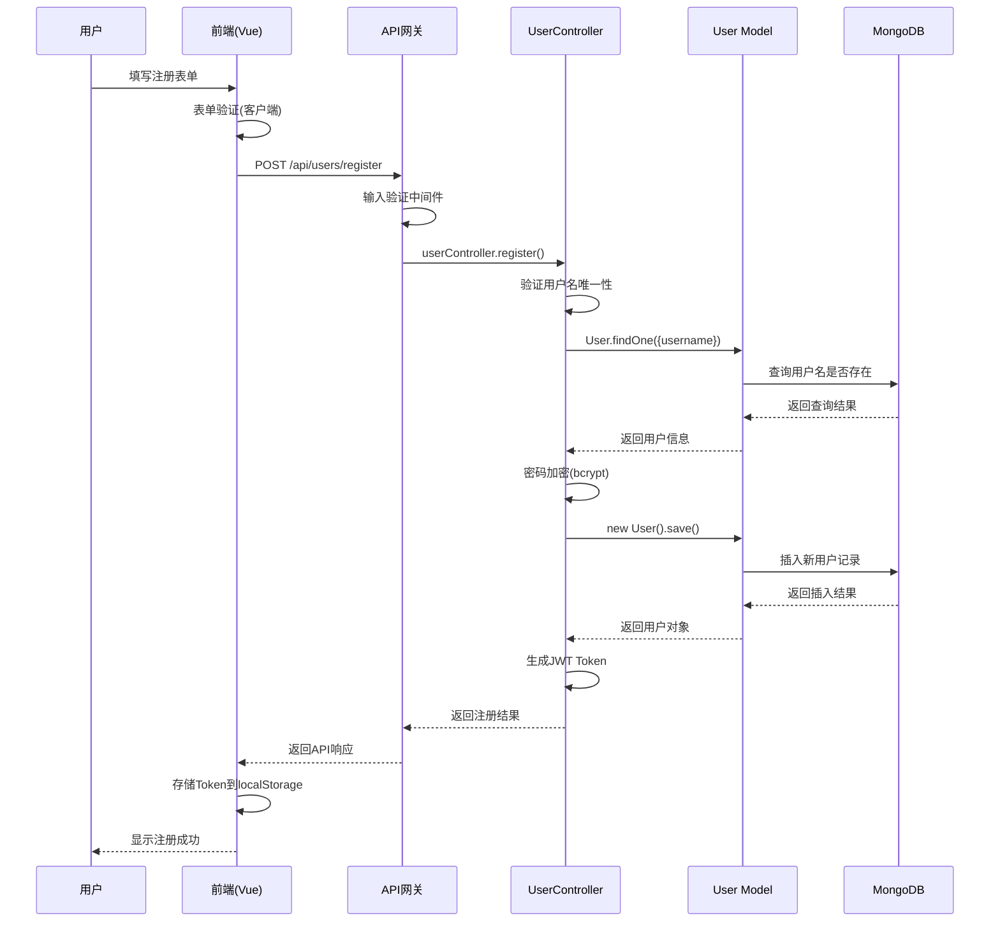
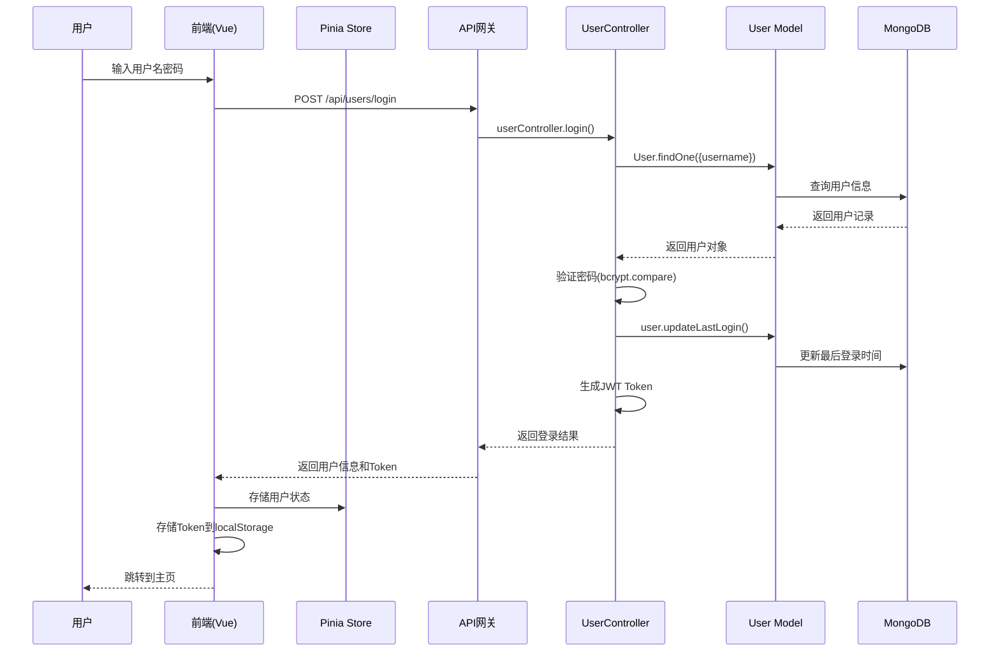
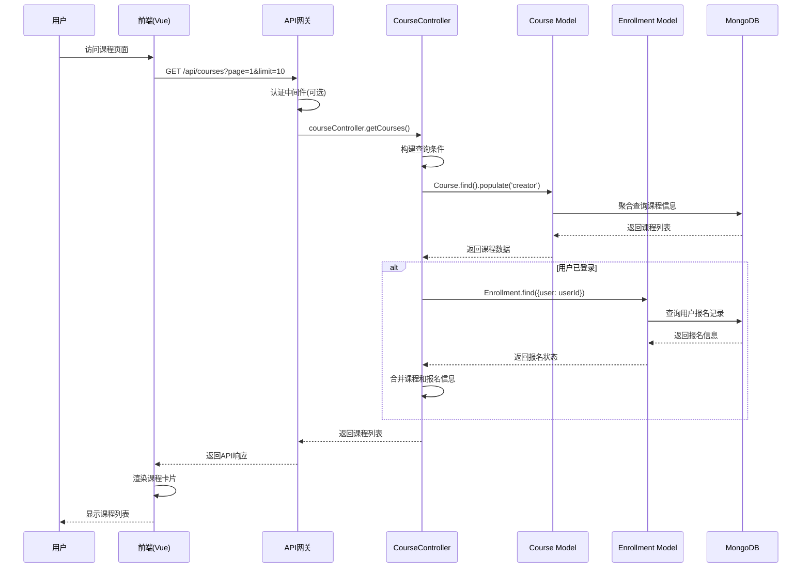
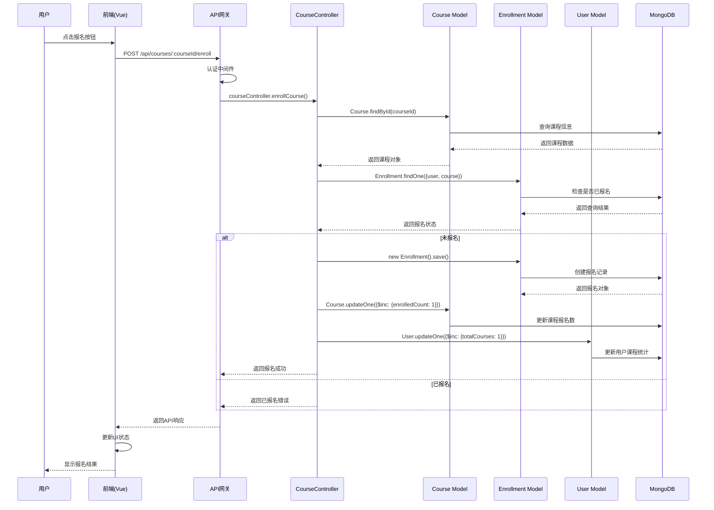
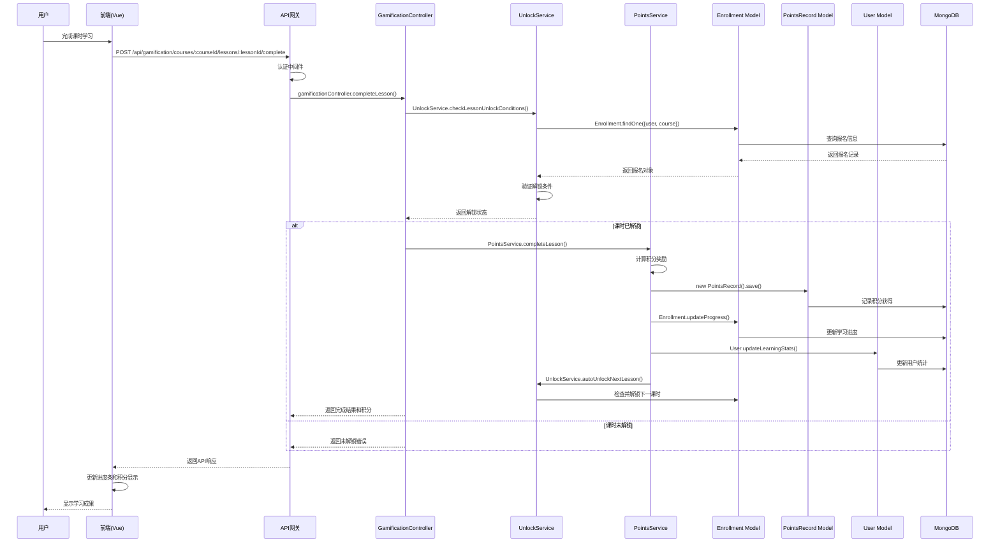
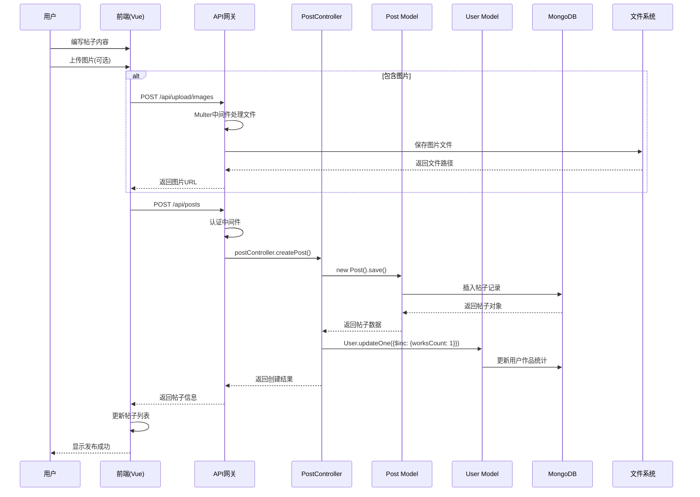
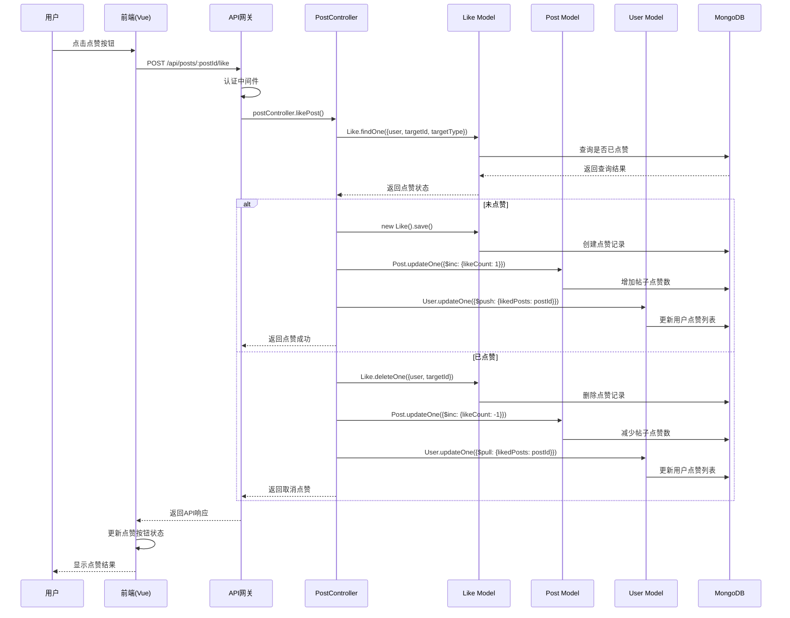
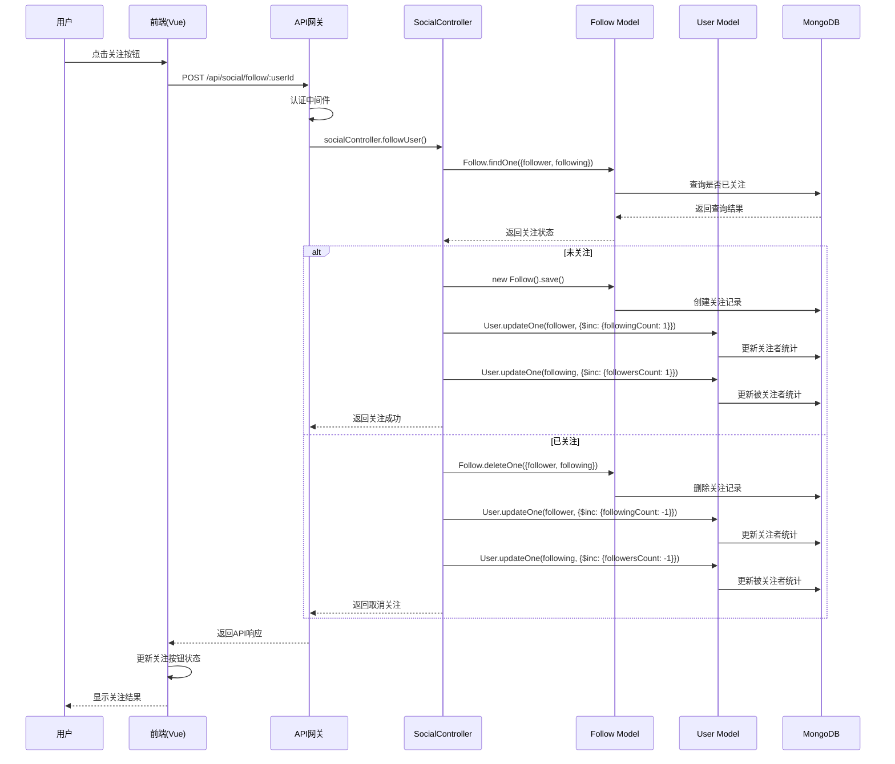
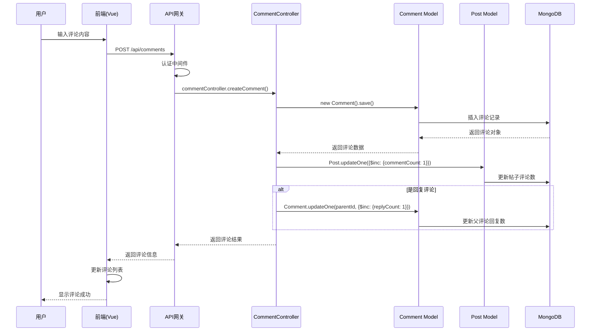
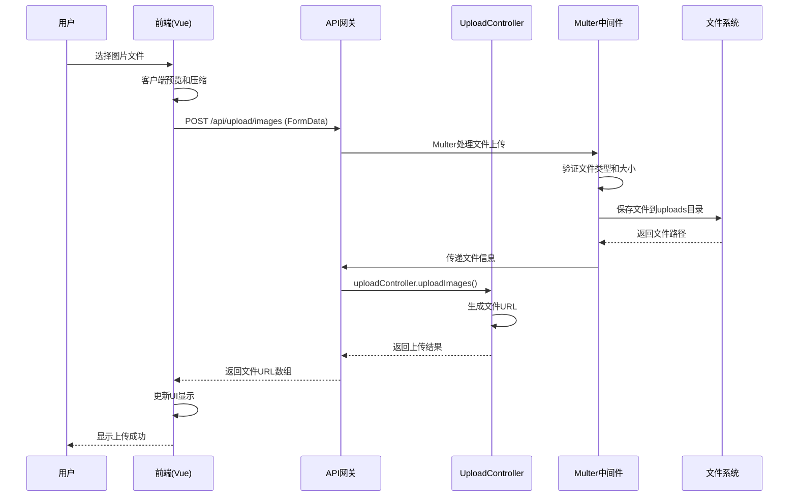

# 前端-后端-数据库调用链逻辑设计分析

## 1. 系统架构概述

### 1.1 技术栈
- **前端**: Vue 3 + Vite + Tailwind CSS + Pinia
- **后端**: Node.js + Express + MongoDB + Mongoose
- **数据库**: MongoDB
- **文件存储**: 本地文件系统 + Multer
- **认证**: JWT Token

### 1.2 系统分层架构
```
┌─────────────────────────────────────────┐
│              前端层 (Vue 3)              │
├─────────────────────────────────────────┤
│            API网关层 (Express)           │
├─────────────────────────────────────────┤
│           业务逻辑层 (Controllers)        │
├─────────────────────────────────────────┤
│           服务层 (Services)              │
├─────────────────────────────────────────┤
│          数据访问层 (Models)             │
├─────────────────────────────────────────┤
│           数据库层 (MongoDB)             │
└─────────────────────────────────────────┘
```

## 2. 核心功能场景调用链分析

### 2.1 用户注册登录场景

#### 2.1.1 用户注册流程


**数据流转:**
1. **前端验证**: 用户名格式、密码强度、确认密码匹配
2. **后端验证**: 用户名唯一性、输入格式验证
3. **数据处理**: 密码加密、用户信息标准化
4. **数据库操作**: 插入用户记录，设置默认值
5. **响应处理**: 生成JWT Token，返回用户基本信息

#### 2.1.2 用户登录流程


### 2.2 课程学习场景

#### 2.2.1 课程列表获取流程


#### 2.2.2 课程报名流程


#### 2.2.3 课时学习和积分获取流程


### 2.3 社交功能场景

#### 2.3.1 发布帖子流程


#### 2.3.2 点赞功能流程


#### 2.3.3 关注用户流程


### 2.4 评论功能场景

#### 2.4.1 发表评论流程


### 2.5 文件上传场景

#### 2.5.1 图片上传流程


## 3. 数据流转模式分析

### 3.1 请求-响应模式
```
前端发起请求 → API网关 → 控制器 → 服务层 → 数据模型 → 数据库
                ↓
前端接收响应 ← API网关 ← 控制器 ← 服务层 ← 数据模型 ← 数据库
```

### 3.2 数据验证层级
1. **前端验证**: 表单验证、格式检查、用户体验优化
2. **API网关验证**: 输入验证中间件、参数格式检查
3. **控制器验证**: 业务逻辑验证、权限检查
4. **模型验证**: 数据完整性验证、约束检查
5. **数据库验证**: 唯一性约束、外键约束

### 3.3 错误处理机制
```
错误发生 → 捕获异常 → 错误分类 → 日志记录 → 响应格式化 → 前端处理
```

## 4. 性能优化策略

### 4.1 数据库查询优化
- **索引策略**: 为常用查询字段建立索引
- **聚合查询**: 使用MongoDB聚合管道优化复杂查询
- **分页查询**: 实现高效的分页机制
- **数据预加载**: 使用populate预加载关联数据

### 4.2 缓存策略
- **前端缓存**: 使用Pinia状态管理缓存用户数据
- **HTTP缓存**: 设置合适的缓存头
- **数据库缓存**: MongoDB内置缓存机制

### 4.3 并发处理
- **事务处理**: 关键操作使用MongoDB事务
- **乐观锁**: 使用版本号防止并发冲突
- **队列机制**: 异步处理耗时操作

## 5. 安全机制

### 5.1 认证授权
```
用户登录 → JWT Token生成 → Token存储 → 请求携带Token → Token验证 → 权限检查
```

### 5.2 数据安全
- **密码加密**: 使用bcrypt加密用户密码
- **输入验证**: 防止SQL注入和XSS攻击
- **文件上传安全**: 限制文件类型和大小
- **CORS配置**: 跨域请求安全控制

### 5.3 API安全
- **请求频率限制**: 防止API滥用
- **参数验证**: 严格验证输入参数
- **错误信息过滤**: 避免敏感信息泄露

## 6. 监控和日志

### 6.1 请求日志
```
请求开始 → 记录请求信息 → 处理请求 → 记录响应信息 → 计算处理时间
```

### 6.2 错误日志
```
异常发生 → 捕获错误 → 记录错误详情 → 错误分类 → 告警通知
```

### 6.3 性能监控
- **响应时间监控**: 跟踪API响应时间
- **数据库性能**: 监控查询执行时间
- **内存使用**: 监控服务器资源使用情况

## 7. 部署架构

### 7.1 开发环境
```
前端(Vite Dev Server:5173) ← → 后端(Express:3000) ← → MongoDB(27017)
```

### 7.2 生产环境
```
Nginx(80/443) → 前端静态文件
     ↓
后端服务(PM2) ← → MongoDB集群
     ↓
文件存储系统
```

## 8. 关键技术点

### 8.1 状态管理
- **前端状态**: Pinia管理全局状态
- **后端状态**: Express中间件管理请求状态
- **数据库状态**: MongoDB事务管理数据一致性

### 8.2 数据同步
- **实时更新**: 前端轮询或WebSocket
- **数据一致性**: 事务保证多表操作一致性
- **缓存同步**: 数据变更时更新相关缓存

### 8.3 扩展性设计
- **模块化架构**: 按功能模块组织代码
- **接口标准化**: 统一的API响应格式
- **配置管理**: 环境变量管理不同环境配置

## 9. 总结

本系统采用经典的三层架构模式，通过清晰的分层设计实现了前端、后端和数据库之间的有效协作。每个功能场景都遵循统一的调用链模式，确保了系统的一致性和可维护性。

**优势:**
- 架构清晰，职责分明
- 数据流转规范，易于调试
- 安全机制完善，保障数据安全
- 性能优化到位，用户体验良好

**改进空间:**
- 可考虑引入缓存层提升性能
- 可实现WebSocket支持实时通信
- 可添加消息队列处理异步任务
- 可引入微服务架构支持更大规模扩展